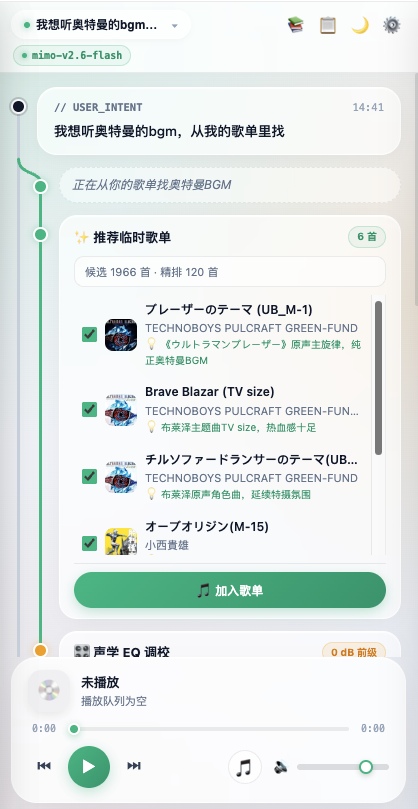
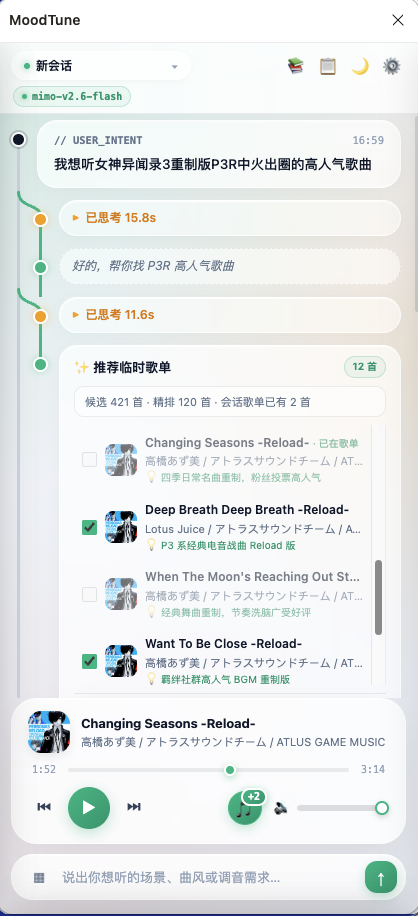
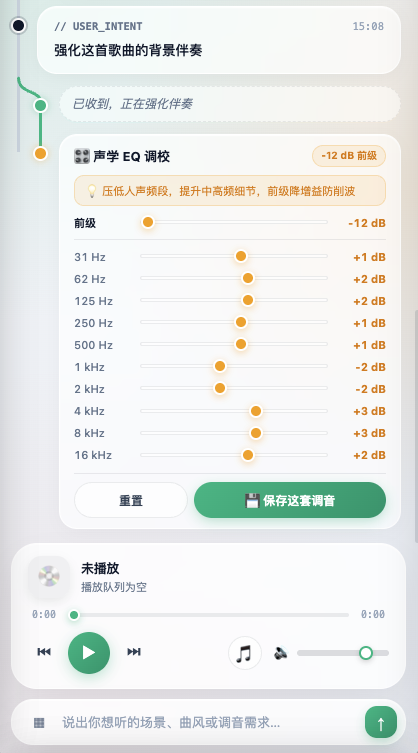
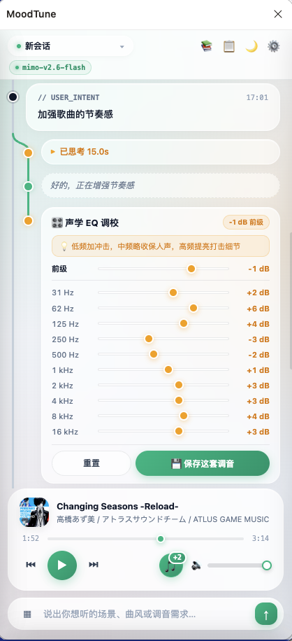
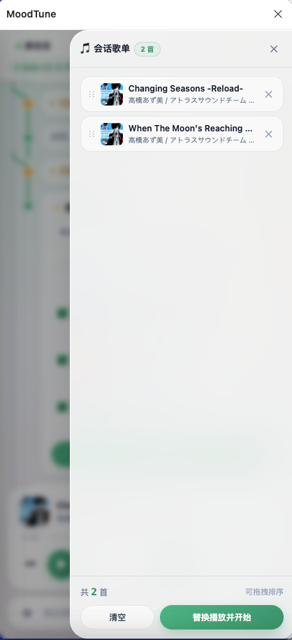
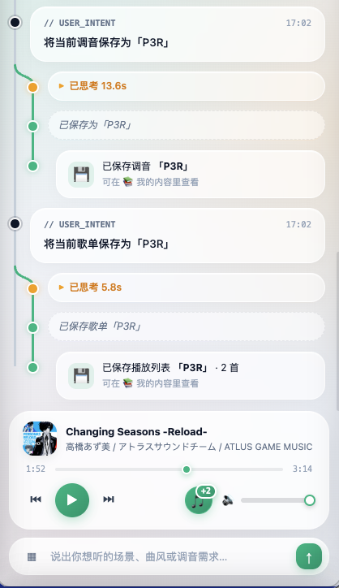
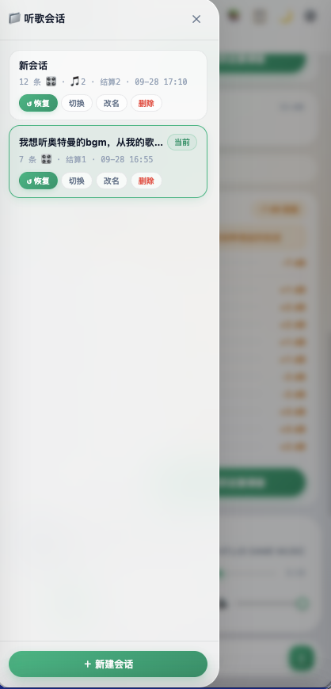
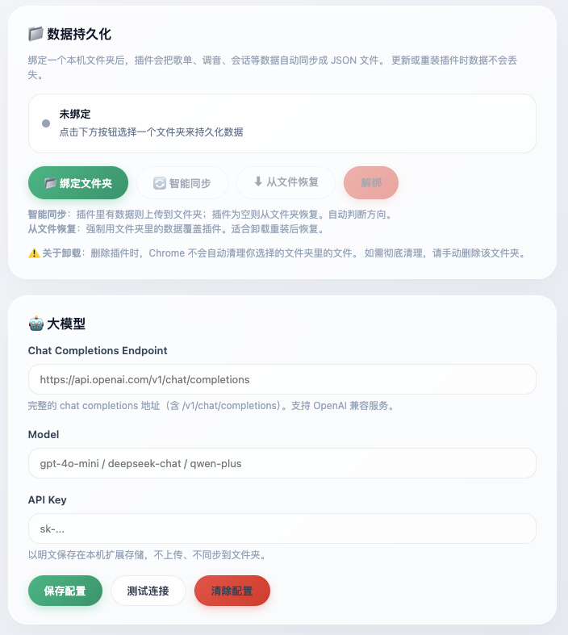

<div align="center">

# MoodTune

**对话式 AI 音乐助手 —— 让音乐跟着语境走**

[](https://developer.chrome.com/docs/extensions/mv3/)
[](https://www.google.com/chrome/)
[](../LICENSE)
[](https://github.com/YunQi-Excellent/moodtune/pulls)

[功能](#-核心特性) · [安装](#-快速开始) · [配置](#-配置大模型) · [架构](#-技术架构) · [路线图](#-路线图)

</div>

---

## 📖 这是什么

MoodTune 是一个 Chrome 浏览器扩展，把「AI 对话」和「音乐播放」缝在了一起。

你可以直接对它说：

> 「想听西川贵教在高达里的歌，人声突出透亮一点，低频收紧别轰头」
>
> 「深夜写代码，来点不吵的，8 首左右」
>
> 「把刚才那套调音存成『深夜安静』」

它会**理解你的意图**，调网易云的接口帮你挑歌、调音、播放，**全程不用离开当前页面**。

它解决的核心痛点是：**听歌这件事没有"搜索框"能表达清楚**。你想找的不是某首歌，而是一种**语境** —— 深夜、通勤、写代码、发呆。MoodTune 让你把这些说出来，剩下的交给 AI。

---

## ✨ 核心特性

### 🎯 意图搜索 —— 说出场景，而不是歌名

不搜"关键词"，搜"感受"。AI 会把你的需求拆解成多路检索（单曲搜索 / 主题歌单挖掘 / 歌手全曲 / 你的个人歌单），然后从几百首候选里**精挑细选出最贴合语境的一小批**。

- 自然语言输入：「适合跑步的有节奏感的歌」「周杰伦那种青春味道的」
- 多路检索 + 精排，避开单一搜索接口的结果上限
- 每条推荐附带一句 AI 给出的**选择理由**
- **会话歌单**模式：像购物车一样，把满意的挑进去，AI 下次检索会自动避开已有的歌





### 🎛 对话式 EQ 调音

内置 10 段均衡器 + 前级，接在 `<audio>` 上，**改参数立即生效**。

- 说「低频再轻一点」「人声更清晰」，AI 会基于**当前 EQ** 微调（不是从零开始）
- 也可以手动拖滑块，实时听到效果
- 满意的调音可以保存成预设，跨会话复用





### 🎵 会话 —— 一次听歌场景的完整记录

每个会话独立保存：**对话历史 + 会话歌单 + 会话调音**。

- 会话之间互不干扰：在 A 会话调好的 EQ，不会污染 B
- 切回旧会话，一键「恢复」到当时的歌单 + 调音
- 会话歌单和调音可以**显式保存为资产**（savedPlaylist / eqPreset），跨会话自由组合







### 💾 数据持久化到本地文件夹

用 **File System Access API** 把数据同步成 JSON 文件：

```text
YourChosenFolder/
├── playlists.json      # 保存的播放列表
├── eq-presets.json     # 保存的 EQ 预设
├── sessions/
│   ├── index.json      # 会话索引
│   ├── sess-xxx.json   # 每个会话的完整数据
│   └── sess-yyy.json
└── .meta.json          # 版本号与最后同步时间
```

- **插件更新、卸载重装，数据不丢**
- 数据是**纯文本 JSON**，可以用 Git 管理、手动编辑、随时备份
- 默认关闭，用户主动绑定文件夹才启用

### 🎧 内置播放器（不打断你正在做的事）

音频在 **offscreen document** 里播放，侧边栏关闭后音乐继续。

- 播放、暂停、上一首、下一首、进度条、音量，全在扩展内搞定
- 不需要切回网易云网页版
- 播歌时会**自动暂停**网页版播放器，避免双重声音

### 🔌 OpenAI 兼容，接什么模型都行

不绑定任何一家。只要服务提供 **OpenAI 兼容的 Chat Completions 接口**，就能接入：

- DeepSeek / Moonshot / 通义千问 / 智谱 / 百川
- OpenAI / Azure OpenAI
- 本机 Ollama / LM Studio / vLLM

---

## 🚀 快速开始

### 安装（开发者模式）

```bash
git clone https://github.com/YunQi-Excellent/moodtune.git
cd moodtune
```

1. 打开 Chrome，访问 `chrome://extensions`
2. 打开右上角的 **开发者模式**
3. 点击 **加载已解压的扩展程序**，选择克隆下来的文件夹
4. 完全关闭 Chrome 再打开（Manifest V3 的 service worker 需要重启）
5. 点击浏览器工具栏的扩展图标 → 侧边栏打开

> **前置条件**：Chrome 116+，且已在 music.163.com 登录网易云账号。

### ⚙️ 配置大模型

1. 侧边栏右上角 ⚙️ → 打开设置页
2. 填写：
   - **Endpoint**：`https://api.deepseek.com/v1/chat/completions`
   - **Model**：`deepseek-chat`
   - **API Key**：`sk-...`
3. 点 **保存配置**，浏览器会请求 `api.deepseek.com` 的访问权限 → 允许
4. 点 **测试连接**，看到成功提示即可



### 开始使用

在侧边栏输入框里试试这些：

| 输入 | 会发生什么 |
| --- | --- |
| 深夜写代码的歌，不要太吵 | AI 检索 → 给出候选卡片 |
| 低频再轻一点，人声清晰些 | 生成并打开调音台 |
| 打开调音台 | 直接打开当前会话的调音台 |
| 把会话歌单保存成「通勤」 | 保存为可复用的资产 |
| 从我的歌单里挑 10 首适合睡觉的 | 从你自己账号的歌单里挑 |

---

## 🏗 技术架构

### 整体结构

```text
┌────────────────────────────────────────────┐
│  Side Panel (sidepanel.html/js)            │
│  对话 UI、会话管理、播放器界面、抽屉         │
└────────────────────────────────────────────┘
                    ↕ chrome.runtime.sendMessage
┌────────────────────────────────────────────┐
│  Background Service Worker (background.js) │
│  Agent 编排、LLM 调用、网易云 API、存储      │
└────────────────────────────────────────────┘
          ↕                          ↕
┌──────────────────┐    ┌──────────────────────┐
│ Offscreen Doc    │    │ 用户选择的本地文件夹  │
│ 音频播放 + EQ    │    │ playlists.json 等    │
└──────────────────┘    └──────────────────────┘
```

### Agent 工作流

意图搜索不是一次简单的 API 调用，而是 **4 阶段流水线**：

```text
用户输入
   │
   ▼
[阶段 1] 规划   LLM 把需求拆解成检索计划
   │             输出：queries / filters / targetCount
   ▼
[阶段 2] 执行   本地并发调用多个网易云接口
   │             收集 200-800 首候选
   ▼
[阶段 3] 粗筛   按时长/关键词过滤 + 按来源权重排序
   │             压缩到 60-120 首
   ▼
[阶段 4] 精排   LLM 从候选中挑出 targetCount 首
   │             每首附上选择理由
   ▼
最终歌单 → 会话歌单 → 用户确认 → 播放
```

关键设计：LLM 只调用 **2 次**（规划 + 精排），中间的检索和过滤全在本地完成。这保证了：

- 成本低（一次搜索总共消耗约 2k-5k tokens）
- 上下文可控（LLM 永远看不到几百首原始数据）
- 失败可降级（某一路检索失败不影响整体）

### 检索工具

Agent 有 4 个可用工具：

| 工具 | 用途 | 权重 |
| --- | --- | --- |
| `searchSongs` | 关键词搜索单曲 | ⭐⭐⭐ |
| `searchPlaylists` | 搜主题歌单 + 挖掘歌单里的全部歌曲 | ⭐⭐ |
| `fetchArtistAllSongs` | 拉某歌手的全部作品（跨专辑） | ⭐ |
| `myPlaylists` | 从用户本人账号的歌单里拉歌 | ⭐⭐⭐⭐ |

权重高的候选在粗筛阶段优先保留。

### 数据存储

| 数据 | 位置 | 生命周期 |
| --- | --- | --- |
| 会话、调音、歌单（活跃缓存） | `chrome.storage.local` | 永久（加 `unlimitedStorage` 无上限） |
| 用户选择的持久化文件夹 | 本机文件系统 | 插件卸载后仍保留 |
| 意图搜索临时状态 | `chrome.storage.session` | 浏览器关闭即清 |
| 播放队列 | offscreen document 内存 | 页面存活期 |
| 用户个人歌单 | 不落盘，每次实时从 API 拉 | — |
| API Key | `chrome.storage.local`，明文 | 永久 |

---

## 🔒 数据与隐私

- API Key 只保存在本机，不上传、不同步到数据文件夹
- 意图搜索只发送：需求文本 + 候选歌曲的 ID / 名称 / 歌手 / 专辑 / 时长
- **不发送**：Cookie、账号信息、页面 HTML、歌单完整内容、API Key
- 不经过作者服务器：所有请求直接从你的浏览器发起
- 数据文件夹里的 JSON 是纯文本，你可以随时查看、编辑、迁移

> ⚠️ **使用 Web 端内部接口**：MoodTune 调用的是网易云音乐网页版自身使用的内部接口。这不是官方开放 API，未来可能变更。如果接口失效，会在 Release Notes 里说明。

---

## 🗺 路线图

- ☑ 意图搜索（4 阶段流水线）
- ☑ 会话歌单（购物车模式）
- ☑ 10 段 EQ 调音台
- ☑ 对话式调音
- ☑ 会话隔离 + 恢复
- ☑ 数据本地文件持久化
- ☐ 多平台适配（QQ 音乐 / Spotify / 本地音乐库）
- ☐ 播放列表跨平台合并
- ☐ Agent 反思循环（候选太少自动重试）
- ☐ 插件内的 Tool Registry（让第三方扩展检索工具）
- ☐ Firefox 版本

---

## 🛠 开发

### 目录结构

```text
moodtune/
├── manifest.json              # 扩展清单
├── background.js              # Service Worker（业务逻辑）
├── sidepanel.html / .js       # 侧边栏
├── offscreen.html / .js       # 音频引擎
├── options.html / .js         # 设置页
├── prompts.js                 # 所有 LLM 提示词（集中管理）
├── fs-manager.js              # File System Access API 封装
├── fs-sync.js                 # 本地文件夹双向同步
└── docs/
    └── index.html             # GitHub Pages 宣传页
```

### 修改提示词

所有 LLM 提示词集中在 `prompts.js`，包括：

- `ROUTER_SYSTEM` —— 意图路由
- `PLANNER_SYSTEM` —— 检索规划
- `RERANK_SYSTEM` —— 候选精排
- `EQ_TUNER_SYSTEM` —— EQ 调音

改完提示词保存 → `chrome://extensions` 刷新扩展即可生效，不用重新构建。

### 调试

- **Background**：`chrome://extensions` → 本扩展 → Service Worker
- **Side Panel**：右键侧边栏 → 检查 → Console
- **Offscreen**：`chrome://extensions` → 本扩展 → 检查视图 → `offscreen.html`

### 提交代码

欢迎 PR！提交前请：

1. 说明动机和改动范围
2. 大改动先开 issue 讨论
3. 保持提示词和业务逻辑分离

---

## 🙏 致谢

- NeteaseCloudMusicApi —— 社区逆向的网易云接口文档
- Lucide —— 图标
- 所有用过的 AI 音乐助手项目，你们让我知道这件事可以做

---

## 📄 License

MIT © 2026 YunQi-Excellent

<div align="center">

如果这个项目对你有帮助，欢迎点一个 ⭐

</div>
